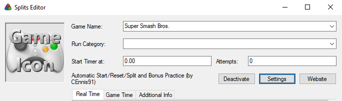
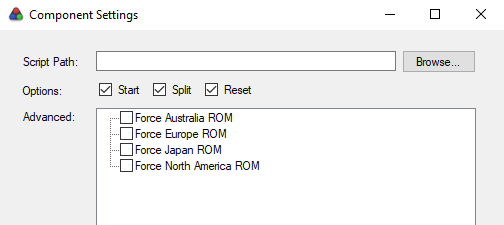
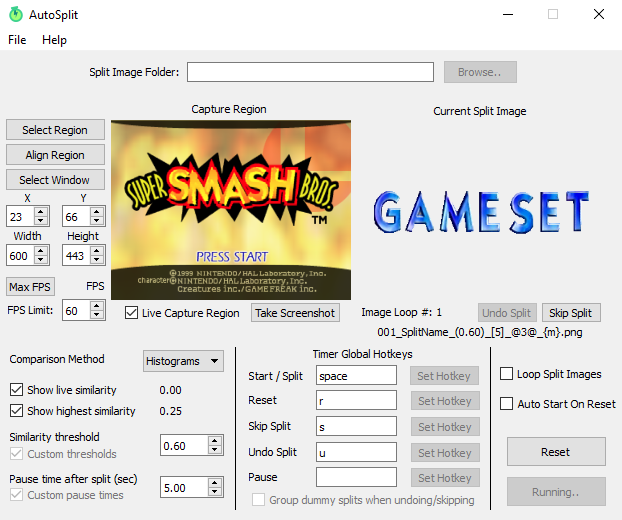

# autosplitters

Auto Splitters for Smash 64 speedrunners

# Getting Started

## Prerequisites
- [LiveSplit](https://livesplit.org/)
- [Project64KSE](https://smash64.online) (others listed below)
- [AutoSplit by Toufool](https://github.com/Toufool/Auto-Split) (required for console)
- [This repo](https://github.com/smash64-dev/autosplitters/archive/refs/heads/main.zip) (required for console)

## Quick Start (Emulator)

- `Edit Splits` in Livesplit and set the game name
- `Activate` the autosplitter
- If you're using a ROM hack/new Remix version, use `Settings` to force the correct version
- Start a [supported emulator](#supported-emulators)

## Quick Start (Console/Emulator)

- Configure the AutoSplit tool by Toufool accordingly (see below)
- Set your global hotkeys (read [this](https://github.com/Toufool/Auto-Split#known-issues))
- Choose the correct `Split Image Folder`
- Manually start the timer when starting a run

# Usage

## Supported Emulators

- [Project64KSE](https://smash64.online)
- Project64KVE (replaced by Project64SE, but still supported)
- *adding more soon*

## Limitations

|                                | LiveSplit          | AutoSplit          |
| ------------------------------ | ------------------ | ------------------ |
| Console                        | :x:                | :heavy_check_mark: |
| Emulator                       | :heavy_check_mark: | :heavy_check_mark: |
| Vanilla ROMs (Na/Jp/Eu/As)     | :heavy_check_mark: | :heavy_check_mark: |
| Smash Remix  (0.9 to latest)   | :heavy_check_mark: | :heavy_check_mark: |
| 1P Game Mode - Split           | :heavy_check_mark: | :heavy_check_mark: |
| 1P Game Mode - Last Hit        | :heavy_check_mark: | :heavy_check_mark: |
| 1P Game Mode - Start           | :heavy_check_mark: | :x:                |
| 1P Game Mode - Reset           | :heavy_check_mark: | :x:                |
| Bonus 1 Practice (Targets)     | :heavy_check_mark: | :x:*               |
| Bonus 1 Practice (Platforms)   | :heavy_check_mark: | :x:*               |
| Remix 1P Mode - Split          | :heavy_check_mark: | :heavy_check_mark: |
| Remix 1P Mode - Last Hit       | :heavy_check_mark: | :heavy_check_mark: |
| Remix 1P Mode - Start          | :heavy_check_mark: | :x:                |
| Remix 1P Mode - Reset          | :heavy_check_mark: | :x:                |
| Remix All-Star Mode - Split    | :heavy_check_mark: | :x:                |
| Remix All-Star Mode - Last Hit | :heavy_check_mark: | :x:                |
| Remix All-Star Mode - Start    | :heavy_check_mark: | :x:                |
| Remix All-Star Mode - Reset    | :heavy_check_mark: | :x:                |

\* *Using AutoSplit to track individual targets/platforms may be possible, but it's finnicky*

# Contributing

TODO

# License

License is [MIT](LICENSE.md).
